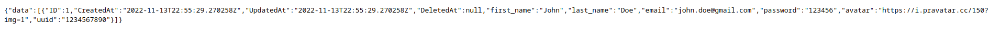
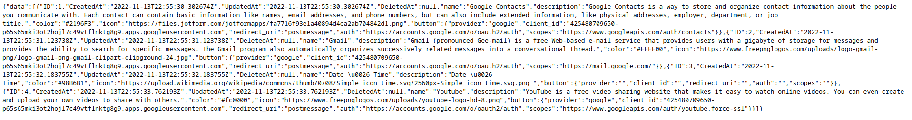
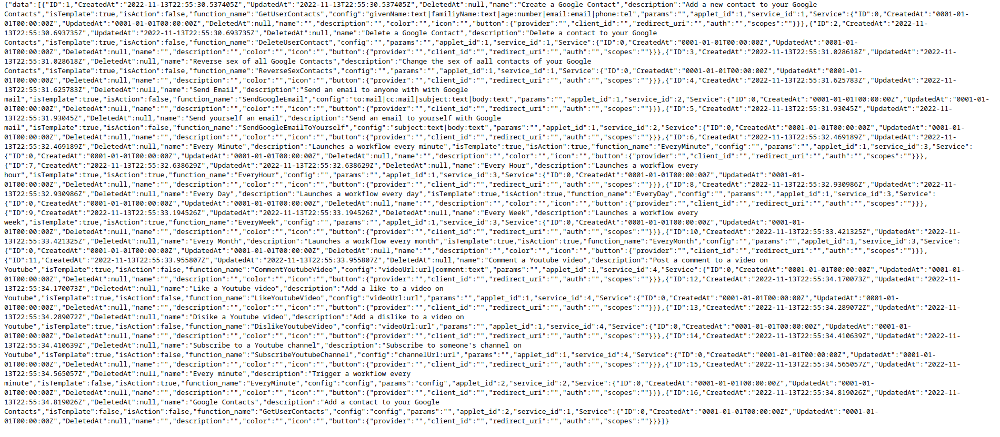
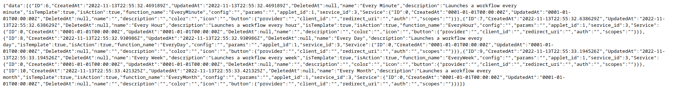
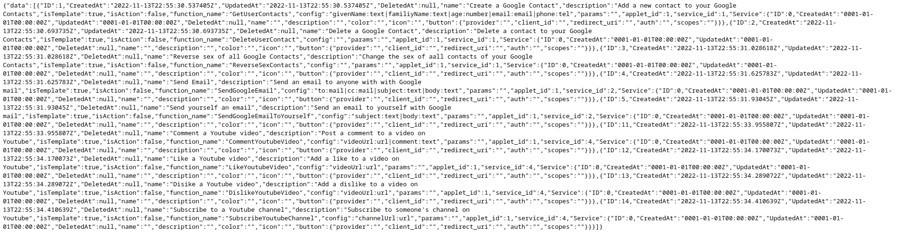
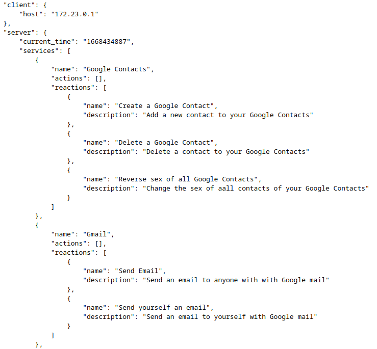

# Epitech - Action REAction
## Module: B5 - Application Development

### Description
The goal of this project is to discover, as a whole, the software platform that you have chosen through the creation of a business application.
To do this, you must implement a software suite that functions similar to that of [IFTTT](https://ifttt.com/) and/or [Zapier](https://zapier.com/).
This software suite will be broken into three parts :

- An **application server** to implement all the features
- A **web client** to use the application from  your browser by querying the **application server**
- A **mobile client** to use the application from your phone by querying the **application server**

# The database

Our database was made in postgreSQL using gorm a golang ORM (Object-Relational Mapping).
It's separated in multiple table: 

## User

The user table contain the information to identifi the user when he register or sign in. The principal information will be the ID that we will use to identifie which service and applet he register to and created.

| Firstname | Lastname | email | Password | Avatar | UUID | Gorm.model |
| --------- | -------- | ----- | -------- | ------ | ---- | ---------- |
| The firstname of the user | the lastname of the user | his email | his password | his avatar | the uuid | default fields to the model (ID, CreatedAt, UpdatedAt, DeletedAt) |

##  Service

The service table contain all the information of the different service our server can handle and the information needed for the front.

The services and action/reaction link it are display in a json file at ***localhost:8080/about.json***

| name | Description | Color | Icon | Button | Gorm.model |
| --------- | -------- | ----- | -------- | ------ | ---------- |
| Name of the service | Description of the service | Color code for the front | his Icon | The button class containing the info needed for the front to create the button | default fields to the model (ID, CreatedAt, UpdatedAt, DeletedAt) |

## Area

The area are what we call the table containing the action and reaction.

| Name | Description | Istemplate | IsAction | fuctionName | config | Params | AppletID | ServiceID | Service | Gorm.model |
| --------- | -------- | ----- | -------- | ------ | ---------- | ------- | ----- | ----- | ----- |---- |
| Name of the Area | Description of the Area | Boolean to know if it's a template for the front (true if template)  | Boolean to know if it's a action or a reaction (true if action) | Name of the function | config string | params string | Id of the applet it's link to | ID of the service it's link to | Link to the service table | default fields to the model (ID, CreatedAt, UpdatedAt, DeletedAt) |

##  Token

The token table contain all the info we received from the connection to a service from a user. It's the data we need to use this service and send request to the webapp it originated from.

| ServiceName | AccessToken | AssociatedEmailAddress | UserID | user |
| --------- | -------- | ----- | -------- | ------ |
| The name of the service associated to this token | The token | the email associated to the token | the ID of the user link to this token | a connection to the user table |

# Router

## Users

The localhost:8080/users url send us to a page containing all of the users stock inside our database and their information.

## Services

The localhost:8080/services url send us to a page containing all of the services stock inside our database and their information.

## Areas

The localhost:8080/areas url send us to a page containing all of the areas (the Action/Reactions) stock inside our database and their information.

Their's two sub division of this pages:

### The actions

The localhost:8080/actions url send us to a page containing all the IsAction == true areas stock insides our database.

### The Reactions

The localhost:8080/reactions url send us to a page containing all the IsAction == false areas stock insides our database.

## The Applets

The localhost:8080/applets/:id url send us to a page containing all the  applets stock insides our database in fuction of our id.

## The Tokens

The localhost:8080/tokens url send us to a page containing all the Tokens stock insides our database.

## The about.json

The localhost:8080/about.json url send us to a page containing multiple information about the client and the server:
### Client
- The IP of the users using the page

### Server

- The current time in unix.
- The services and all the actions/reactions link to this services

# Our Dev Team

| [ Axel Boqueho](https://github.com/Axel-B09) | [ Bill On](https://github.com/Bill-ON) | [ Guilhem Santé](https://github.com/Guilhem-Sante) | [ Louis Piochaud](https://github.com/LouisPiochaud) | [ Tomas Proust](https://github.com/TomasProust)
| :---: | :---: | :---: | :---: | :---: |